# springGuide

### 이 Repository는

스프링을 공부하고 정리하고자 남겼습니다.   
기억이 애매하면 ctrl+f 하기 위해 남깁니다.

### Studied from

[인프런 김영한님 완전 정복 로드맵](https://www.inflearn.com/roadmaps/149)   
[스파르타 웹개발의 봄, Spring](https://spartacodingclub.kr/)

* # 원리
  <details>
  <summary>
  영속성 컨텍스트
  </summary>
  <br>
  
      

  영속성 컨텍스트를 이해하기 위해서는 '영속하다' 라는 말의 의미를 이해해야 한다.    
  영속하다, persist 는 '영원히 지속하다' 라는 의미를 갖고 있습니다.    
  
  즉 컨텍스트라는 곳에서 ORM 된 객체의 정보를 지속적으로 관리하며 DB에 영속시킨다는 의미입니다.   

  * 비영속(New)    
    자바 내에서 new 로 생성할 경우   
    영속성 컨텍스트와 아무런 관련이 없는 상태   
    `User user = new User();`   
    <br>
    
  * 영속(Managed)   
    컨텍스트 안에서 관리중인 상태   
    `em.persist(user);` `em.find(user);`   
    <br>
    
  * 준영속(Detached)   
    컨텍스트 안에서 더는 관리하지 않는 상태    
    비영속 상태와 비슷하지만 다릅니다.   
    준 영속 상태는 한번 영속이 되어서 식별자 (id) 값이 존재한다.   
    `em.detach(user)` `em.clear()` `em.close()`   
    <br>
    
  * 삭제(Removed)    
    컨텍스트 안에서도 삭제를 하고 데이터베이스 안에서도 삭제한 상태
    <br>
  </details>
  <br>
  
  <details>
  <summary>
  Dirty Checking
  </summary>
  <br>

     
  
  영속성 컨텍스트의 Managed(영속) 상태의 객체는 1차 캐시 저장소에
  snapshot 이라는 복사본이 저장됩니다.
  
  이 snapshot 과 해당 객체의 내용이 다르다면 변경이 감지됩니다.   
  
  변경은 바로 저장되지 않고 쿼리문 저장소에 저장되었다가 `flush()` 가 일어난 시점에서 DB에 변경사항을 적용합니다.   
  
  예를 들어   
  ```java
  EntityManager em = entityManagerFactory.createEntityManager();
  EntityTransaction tx = em.getTransaction();
  tx.begin();
  // managed 상태
  User user = em.find(User.class, id);
  // managed 상태의 객체 변경
  user.changePassword(password);
  // 트렌젝션 커밋
  tx.commit();
  ```
  
  위 코드에는 `user` 를 save 하라는 예기는 어디에도 없습니다.   
  
  `tx.commit()` 을 실행할 때 dirty checking 의 쿼리문 저장소에 저장된 쿼리를 실행시켜서 
  코드상으로 명시하지 않더라도 user 의 정보가 변경되는 것입니다.   
  
  </details>
  <br>
  <br>

* # A
* # B
* # C
  <details>
  <summary>
  cascadeType.Persist : 부모가 영속되면 자식도 적용 
  </summary>
  <br>
  
  실제로는 반드시 부모 자식의 관계라고 생각하시기보단    
  cascadeType.Persist 가 들어간 클래스와 그 연관된 클래스 관계입니다.    
  
  @OneToMany, @ManyToOne 관계를 만든다고 가정하겠습니다.   
  CascadeType.PERSIST 를 적용하고 싶다고 생각하겠습니다.   
  여기에서 잠시 질문을 하나 드리면   
  
  @OneToMany(cascade = CascadeType.PERSIST) 가 맞을까요?      
  아니면   
  @ManyToOne(cascade = CascadeType.PERSIST) 가 맞을까요?   
  
  여기에서 정답은?   
  "전혀 상관 없다." 입니다.   
  
  @OneToMany, @ManyToOne 관계는 상관이 없습니다.   
  
  CascadeType.PERSIST 가 의미하는 바는   
  내가 쓰인 곳이 PERSIST 된다면, 연관관계의 entity 도 PERSIST 해줘 입니다.   
  
  예를 들어   
  ```java
  Parent parent = new Parent();
  parent.addChild(new Child());
  em.persist(parent);
  ```
  를 한다면, persist는 parent 하나만 적었지만   
  parent 와 child 둘다 persist 되어 저장됩니다.      
  
  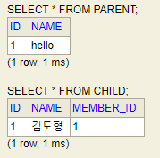   
  
  entityManager 가 죽어가서 JPARepository 로 바꿔보면         
  ```java
  Parent parent = new Parent();
  parent.addChild(new Child());
  parentRepository.add(parent);
  ```
  가 되겠습니다.   
  
  @OneToOne, @OneToMany, @ManyToOne, 어떤 관계이든   
  persist 가 되는 객체에서 지정하여 사용할 수 있습니다.   
  
  cascadeType.Remove 만큼 조심하게 사용하실 필요는 없지만      
  단일하고 연속적으로 생성되는 entity 에 사용하면 좋을 것 같습니다.   
  생각좀 하고 살자 도형아.   
  </details>
  <br>
  
  <details>
  <summary>
  cascadeType.Remove : 부모가 삭제되면 자식도 적용
  </summary>
  <br>

  실제로는 반드시 부모 자식의 관계라고 생각하시기보단    
  cascadeType.Remove 가 들어간 클래스와 그 연관된 클래스 관계입니다.   
  
  cascadeType.Remove 는 .Persist 와 같은 맥락입니다.   
  cascadeType 가 이해가 안되신다면, 먼저 .Persist 를 보고 와주세요.   
  
  그런데 여기에서 궁굼증이 하나 생겼습니다.   
  
     
  
  다음과 같이 저장되어 있다고 할 때   
    
  parentClass 에서는   
  ```java
  @OneToMany(mappedBy = "parent", cascade = CascadeType.REMOVE)
  List<Child> children = new ArrayList<>();
  ```
  다음과 같이 정의되어 있다면...   
  
  A   
  ```java
  Parent parent = em.find(Parent.class, 1L);
  parent.getChildren().remove(0); 
  em.persist(parent);
  em.flush();
  em.clear();
  ```
  
  B   
  ```java
  Parent parent = em.find(Parent.class, 1L);
  // parent.getChildren().remove(0);  
  em.remove(parent);
  em.flush();
  em.clear();
  ```

  A 와 B 중에서 어떤 방법이 children 을 삭제할까요?   
  
  <br>
  직접 확인해본 결과 정답은 B 였습니다.   
  
  A 에서 삭제가 적용되길 원하신다면 orphanRemoval 을 사용하셔야 합니다.

  </details>
  <br>
  
  <details>
  <summary>
  cascadeType.All : 부모의 영속성 컨텍스트를 자식도 적용
  </summary>
  <br>
  
  위 2개 외에도 모든 cascadeType 을 자식에게 적용합니다.
  </details>
  <br>
* # D
  <details>
  <summary>
  ddl-auto : 데이터베이스 스키마 생성 방침
  </summary>
  <br>
  
  application properties 에 `spring.jpa.hibernate.ddl-auto=` 형태로 존재한다.   
  
  create : 기존 태이블 삭제 후 다시 생성   
  create-drop : create 와 같지만 종료 시점에 삭제   
  update : 변경분만 반영   
  validate : 엔티티와 테이블이 매핑되었는지 확인   
  none : 사용안함   
  
  개발 초기 단계 : create, update    
  테스트 서버 : update, validate      
  운영 서버 : validate, none   
  </details>
* # E
  <details>
  <summary>
  @Enheritance 로 부모 클래스를 구현하자
  </summary>
  <br>

  @SupperMapping 의 java 내부 구조는 같습니다.    
  Extends 를 사용해서 부모를 지정해주는 형식입니다.   
  다만 데이터베이스는 3가지로 다르게 구성할 수 있습니다.      
  이 방식들에 따라 @SuperMapping 은 3가지 전략이 있습니다.

  ### JOIN 전략
     
  부모 클래스 Item
  ```java
  @Entity
  @Enheritance(strategy = InheritanceType.JOINED)
  @DiscriminatorColumn
  public class Item{
    ...
  }
  ```
  자식 클래스 Album/Movie/Book
  ```java
  @Entity
  @DiscriminatorValue("A")
  public class Album extends Item{
    ...
  }
  ```
  ALBUM, MOVIE, BOOK 은 각각 ITEM 의 ID를 받아오는 것을 알 수 있습니다.

  여기에서 DTYPE 이라는 column 이 하나 존재하는데   
  이 column 은 @DiscriminatorColumn 을 추가하면 생기는    
  column 으로 자식이 어떤 class 에 속해있는지 String 으로 나타냅니다.      
  @DiscriminatorColumn 은 생략이 가능합니다.

  만약 테이블명 그대로 DTYPE 에 지정되는 것을 바꾸고 싶다면   
  @DiscriminatorValue("A")으로 직접 자식 클래스에서 구분지을 수 있습니다.

  저장은 java 에서 자식 클래스를 사용하면 부모의 parameter 에 접근할 수 있음으로
  ```java
  Album album = new Album();
  album.setName("Son lux - Bones");
  em.persist(album);
  ```
  같이 사용하시면 됩니다.

  ### SINGLE_TABLE 전략
  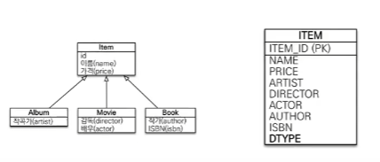   
  jpa default 전략입니다.   
  Child 와 Parent 를 단일한 테이블에 저장하는 단순한 방법입니다.   
  Join 을 하지 않아 SQL query 의 성능적 이점을 갖습니다.   
  다만 정규화 법칙을 따르지 않아 생기는 문제들도 고려해야 합니다.

  부모 클래스의 item
  ```java
  @Entity
  @Enheritance(strategy = InheritanceType.SINGLE_TABLE)
  //@DiscriminatorColumn
  public class Item{
  ...
  }
  ```
  자식 클래스의 Album/Movie/Book
  ```java
  @Entity
  @DiscriminatorValue("A")
  public class Album extends Item{
    ...
  }
  ```
  모든 내용은 위와 비슷비슷합니다.   
  그런데 여기에서 특이한 점은 `@DiscriminatorColumn` 이 없어도   
  무조건 DTYPE 의 column 이 만들어진다는 점입니다.   
  DTYPE 가 만들어지지 않는다면 어떤 자식인지를 구분하는 것이 불가능합니다.   
  물론 null 값이 어디에 들어갔는지 확인하는 방법이 있겠지만...   
  효율적인 방법이라고 보지 않습니다.   
  마지막으로 null 값들이 들어가서 DB 분들이 좋아하지 않습니다.   

  ### TABLE_PER_CLASS 전략
  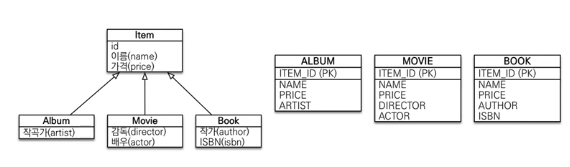      
  이 전략은 부모 테이블을 생략하고 자식 테이블에 부모 param을 모두 넣는 전략입니다.    
  부모 클래스의 item
  ```java
  @Entity
  @Enheritance(strategy = InheritanceType.SINGLE_TABLE)
  public class Item{
  ...
  }
  ```
  자식 클래스의 Album/Movie/Book
  ```java
  @Entity
  public class Album extends Item{
    ...
  }
  ```

  여기에서 주의해서 보셔야 할 점은   
  `@DiscriminatorColumn`, `@DiscriminatorValue`가 없어진다는 점입니다.   
  위의 그림을 자세히 보시면 각 child 가 테이블로 분리되어서   
  DTYPE 이 필요가 없어진다는 것을 알 수 있습니다.

  이 전략은 치명적인 단점이 있습니다.   
  한개의 id를 통해 찾으려고 한다면 3개의 테이블을 조회해야 합니다. 그래서 현업에서는 사용되지 않습니다.
  </details>
  <br/>

  <details>
  <summary>
  @Entity 에서는 setter 를 열지 말자
  </summary>
  <br>

  @Setter 가 열려 있어 너무 많은 변경 포인트가 있다면 유지보수가 어렵다   
  @Setter 는 그 의도를 파악하기 어렵다.    
  또한 객체의 일관성을 보장하기 어렵다.     
  Constructor, builder 를 최대한 활용하자.    
  가령 사용하더라도 정해진 비즈니스 로직을 짜서 규정하고 사용하자.
  </details>
  <br>
  
  <details>
  <summary>
  @Embeddable, @Embedded 를 활용하자
  </summary>
  <br>

  Entity 내부 Class 를 관계형 연결(일 대 다, 일 대 일...etc) 없이 나타낼 수 있다.   
  @Embedded 안에는 @NoArgsConstructor 가 필요하다.    
  
  Java 내에서만 적용된다   
  
  @Embeddable   
  
  ```java
  @Embeddable
  @Getter
  public class Address {
  private  String city;
  private String street;
  private String zipcode;
  }
  ``` 
  
  @Embedded
  ```java
  @NoArgsConstructor(access = AccessLevel.PROTECTED)
  @Getter
  @Entity
  public class Member {
      @Id
      @GeneratedValue(strategy = GenerationType.IDENTITY)
      @Column(name = "member_id")
      private Long id;
  
      @Column
      private String name;
  
      @Embedded
      private Address address;
  }
  ``` 
  
  Java 내에서만 적용되며 database 에 관계형으로 정의되지 않는다.    
  
  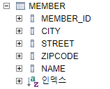   

  이제 조금 더 심화된 내용으로 들어가면...   
  
  임베디드의 연관관계    
  
  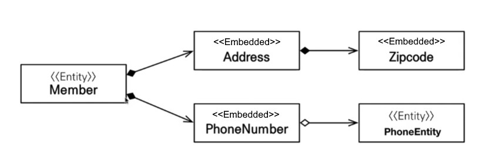    
  
  임베디드 클레스에 임베디드 클래스를 넣으면 조금 더 정리 정돈이 될 수 있습니다.          

  @Entity 안에 @Embedded 안에 @Embedded 를 넣어봅시다.

  ```java
  @Entity
  public class Parent {
  
  @Id
  @GeneratedValue
  private Long id;

  @Embedded
  private Embedable embedable;
  }
  ```
  entity

  ```java
  @NoArgsConstructor
  @Embeddable
  public class embeddable {
  
      private String jack;
  
      @Embedded
      private Embedable2 embedable2;
  }
  ```
  entity -> embedded

    ```java
  @NoArgsConstructor
  @Embeddable
  public class embeddable2 {
  
      private String shit;
  }
  ```
  entity -> embeddable -> embeddable2    

  모든 embeddable 은 반드시 @NoArgsConstructor 를 갖고 있어야 합니다.    

  이렇게 만들면     
  
  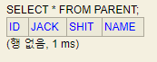    
  테이블은 이렇게 정의됩니다.   
  
  이제 entity -> embeddable -> embeddable2 관계는 가능하니...   
  entity -> embeddable -> entity2 을 구현해보겠습니다.   
  
  위의 클래스는 다 그대로 가져가는데 Embeddable2 만 좀 수정하면 됩니다.      
  
  ```java
  @NoArgsConstructor
  @AllArgsConstructor
  @Getter
  
  @Embeddable
  public class Embeddable2 {
  
  private String jack;
  
      // 위어서 추가되는 부분
      @OneToOne
      @JoinColumn(name = "ENTITY_CHILD_ID")
      private EntityChild entityChild;
  }
  ```
  
  그리고 추가되는 EntityChild Class 를 만듭니다.   
  
  ```java
  @Getter
  @NoArgsConstructor
  
  @Entity
  @Table(name = "ENTITY_CHILD")
  public class EntityChild {
  @Id
  @GeneratedValue(strategy = GenerationType.IDENTITY)
  private Long id;
  }
  ```
  
  이렇게 되면   
  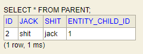   
  가 됩니다.    
  
  하면서 이상하게 query 가 테이블 명을 잘못 적어서 @Table 을 지정해줘야 했지만 
  이정도 에러들은 다 잡아내실 수 있는 분들이라 믿습니다.   
  </details>
  <br>

  <details>
  <summary>
  @Enumerated(EnumType.STRING) 로 enum column 을 만들자
  </summary>
  <br>

  반드시 EnumType.STRING 을 사용하자    
  Integer 는 enum 이 삭제/변경되었을 때 같은 숫자가 중복되어 사용된다   
  
  ```java
  enum OrderStatus {
    ORDER, CANCEL;
  }
  ```  
  
  ```java
  @Getter
  @Entity
  public class Order {
      @Id
      @GeneratedValue(strategy = GenerationType.IDENTITY)
      private Long id;
    
      @Enumerated(EnumType.STRING)
      private OrderStatus status;
  }
  ```
  </details>

* # F
  <details>
  <summary>
  Fetchtype 은 반드시 Lazy 로 지정한다
  </summary>
  <br>

  모든 연관된 테이블들이 딸려 나와서 n+1 폭탄을 맞고 싶지 않다면 lazy 로 사용하자      
  쿼리는 본인이 customize 하여 최적화 할 수 있게끔 만들어야 한다   
  
  fetchtype 을 지정하지 않은 경우   
  @ManyToOne 의 경우 FetchType 은 eager 이며   
  @OneToMany 의 경우 FetchType 은 lazy 이다.   
  
  @ManyToOne 에 주의하자.    
  
  lazy 가 설정된 이후 getter 를 사용하면 query 가 나간다.   
  
  n+1 문제는 여기에도 정리되어 있으니 확인하자.
  </details>
  <br>
  
  <details>
  <summary>
  Foreign key 를 사용한다면 반드시 name 을 지정한다
  </summary>
  <br>

  연관 관계 중 foreign key 가 생성된다면 spring 에서 임의로 이름을 만든다      
  임의로 지정된 이름은 JJ9J21D82 같은 gibberish 이기 때문에 user_account_fk 처럼 정의하자   
  
  ```java
  @JoinColumn(name = "account_id", foreignKey = @ForeignKey(name = "user_account_fk"))
  ``` 
  
  반드시 fk를 사용하지 않아도 된다.   
  조금 더 유연한 시스템을 운영하고 싶다면 fk를 사용하지 않고 연결관계를 정의만 하는 것 또한 하나의 방법이다.   
  </details>
* # G
* # H
  <details>
  <summary>
  H2 : 로컬에서 간편하게 연결하는 임시 데이터베이스

  </summary>
  <br>

    * 설치   
      우선 spring initializr 에서 h2 가 추가됬는지 확인한다.   
      [h2 설치 링크](https://www.h2database.com/html/main.html)   
      설치된 경로에서 \H2\bin 을 들어간다.   
      h2.sh 또는 bat 을 실행한다.   
      localhost:8082 를 들어간다.   
      JDBC url 을 jdbc:h2:file:~/testDB 로 바꾼다.   
      :mem 의 경우 메모리 :file 의 경우 파일 저장이다.   
      ~/의 경로는 user 에서 시작된다.   
      저장된 파일 경로 예시 : C:\Users\doe\testDB.mv.db   
      jdbc:h2:file:D:\Program Files (x86)\H2\saved\testDB 로 특정 경로를 지정해도 된다.         
      <br>

    * 연결  
      스프링과 h2의 연결은 application.properties 에서
      ```
      spring.datasource.url=jdbc:h2:tcp://localhost/~/testDB
      spring.datasource.driverClassName=org.h2.Driver
      spring.datasource.username=sa
      spring.datasource.password=
      spring.jpa.database-platform=org.hibernate.dialect.H2Dialect
      ``` 
      testDB는 사용자가 지정한 명칭으로 바꿔도 된다.      
      그 이외에 추가하면 좋은 properties 도 잊지 말자
      ```
      # 테이블이 없다면 자동으로 생성한다.
      spring.jpa.hibernate.ddl-auto=create
      # sql 을 로깅으로 표시한다.
      # spring.jpa.show-sql=true
      logging.level.org.hibernate.sql = debug
      ``` 
  </details>
* # I
* # J
* # K
* # L
* # M
  <details>
  <summary>
  @ManyToMany 관계는 절대 사용하지 말자
  </summary>
  <br>

  many to many 사이의 테이블은 entity 로 정의되지 않는다.      
  Relation 으로 자동 생성되어서 변경에 용의하지 않다.   
  
  중간 테이블 엔티티를 직접 만들고 사용하도록 하자.   
  </details>
  <br/>

  <details>
  <summary>
  @ManyToOne 단방향 매핑
  </summary>
  <br>
  
  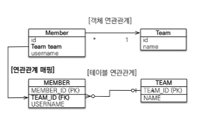   
  Team 과 Member class 가 있다고 가정하면   
  Member class 에서
  ```java
  @ManyToOne
  @JoinColumn(name = "team_id")
  private Team team;
  ``` 
  으로 team 을 매핑한다.   
  
  그리고 단방향임으로 Team class 에서는 members 을 참조하지 않는다.   
  그럼으로 Team class 에서 `List<Member> members` 는 존재하지 않아도 된다.   
  </details>
  <br>
  
  <details>
  <summary>
  @ManyToOne 양방향 매핑
  </summary>
  <br>
  
  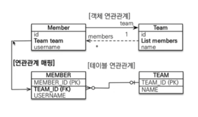   
  Team 과 Member class 가 있다고 가정하면   
  Member class 에서
  ```java
  @ManyToOne
  @JoinColumn(name = "team_id")
  private Team team;
  ``` 
  Team class 에서
  ```java
  @OneToMany(mappedBy = "team")
  private List<Member> members = new ArrayList<>();
  ``` 
  로 매핑한다.   
  
  여기에서 `@OneToMany` 의 `mappedBy` 는 member class 의 Team 객체 명 team 을 지정한다.   
  
  또한 Many 쪽이 외래키를 가져야 하고 One 쪽은 mapping 을 당하는 쪽이라서 수동태의 mappedBy 가 지정되는 것이다.   
  </details>
  <br/>

  <details>
  <summary>
  @MappedSuperclass 로 공통된 column 들을 묶자
  </summary>
  <br>
  
  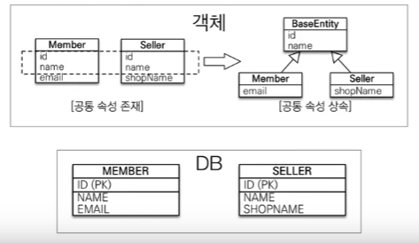   
  두가지 객체에서 공통된 column 이 많이 사용된다 싶으면   
  DB 에 적용되지 않으면서 다른 class 에 옮겨 통일시킬 수 있습니다.   
  
  BaseEntity   
  ```java
  @MappedSuperclass
  public abstract class BaseEntity{
    @Column
    private String name;
  }
  ```
  
  Member   
  ```java
  @Entity
  public class Member extends BaseEntity{
    ...
  }
  ```
  
  @Inheritance 와 다른 점이라고 한다면   
  Inheritance 는 부모관계에 따라 SQL 에도 적용되는 strategy 들이 있다는 점이다.   
  그래서 `em.find(BaseEntity.class, id)` 같은 조회는 불가능하다.    
  또한 직접 사용할 일이 없다면 abstract 를 붙여 추상 클래스로 바꾸자.   
  </details>
  <br>
  
* # N
  <details>
  <summary>
  n+1 문제 : SELECT * query 이후 나온 n 만큼 SELECT 하는 쿼리 폭탄
  </summary>
  <br>

  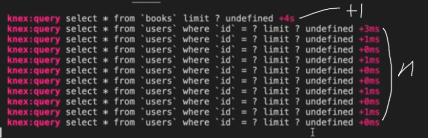
  이런 쿼리문이 보인다면 n + 1 문제입니다.   
  Spring 에서 n + 1 이 생긴다면 fetchtype.eager 를 하였는지 확인합시다.   
  For each 문에서도 n + 1 이 발생할 수 있습니다.   
  
  해결법은 크게 2가지 있습니다.   
  
  Join fetch
  ```java
  @Query("select a from books a join fetch a.users")
  List<books> findAllJoinFetchUsers();
  ```
  2중 join fetch   
  ```java
  @Query("select a from books a join fetch a.users u join fetch u.account")
  List<books> findAllJoinFetchUsersWithAccount();
  ``` 
  join fetch 는 inner join 입니다.   
  <br>
  
  Entity graph   
  ```java
  @EntityGraph(attributePaths = "users")
  @Query("select a from book a")
  List<Academy> findAllEntityGraphUsers();
  ``` 
  2중 entity graph
  ```java
  @EntityGraph(attributePaths = {"users", "users.account"})
  @Query("select a from book a")
  List<Academy> findAllEntityGraphUsersWithAccount();
  ``` 
  entity graph 는 left outer join 입니다.   
  
  [join 을 밴다이어그램으로 설명](https://joins.spathon.com/)   
  
  </details>
* # O
  <details>
  <summary>
  @OneToMany 단방향 매핑
  </summary>
  <br>
  
  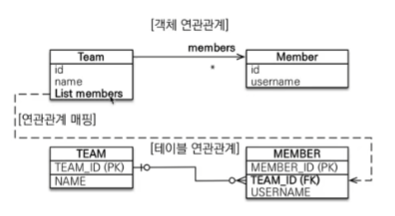    
  Team class 내에서   
  ```java
  @OneToMany
  @JoinColumn(name = "team_id")
  private List<Member> members = new ArrayList<>();
  ```
  를 하면 되고 단방향이기에 member class 에서 지정하지 않는다.   
  
  동작은 한다. 다만!   
  다음과 같은 구조에는 성능 최적화에 큰 문제가 있다.   
  
  예를 들어   
  ```java
  Member member = new Member("김도형");
  em.persist(member);
  
  Team team = new Team("1조");
  team.getMembers().add(member);
  em.persist(team);
  ```
  에서      
  ```java
  Team team = new Team("1조");
  team.getMembers().add(member);
  em.persist(team);
  ```
  이 부분이 실행 될 때   
  Team 객체 내에서는 members 가 존재하지만   
  TEAM 테이블에는 members 를 지정할 수 있는 방법이 없다.   
  그래서 hibernate 는 MEMBER table 의 TEAM_ID 를 조작하여   
  UPDATE query 를 추가하게 되어 낭비가 일어난다.   
  
  @ManyToOne 단방향이나 양방향을 활용하자.   
  Java 와 SQL 의 연결 구성이 같은 곳에서 일어나는 것을 알 수 있어 더 단순하고, 더 최적화에 용이하다.   
  위의 문제도 member 는 team_id를 바로 지정하며 insert 되게 바뀐다.     
  </details>
  <br/>
  
  <details>
  <summary>
  @OneToOne 단방향 매핑
  </summary>
  <br>
  
  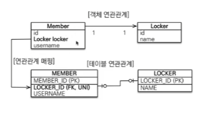   
  Member Class 에서   
  ```java
  @OneToOne
  @JoinColumn(name = "LOCKER_ID")
  private Locker locker;
  ```
  로 지정하면 된다.   
  
  반대로 locker 를 주체로 만들고 싶다면   
  locker 에 `private Member member` 를 지정하면 된다.   
  
  단방향임으로 반대쪽에는 참조를 넣지 않는다.   
  </details>
  <br/>
  
  <details>
  <summary>
  @OneToOne 양방향 매핑
  </summary>
  <br>
  
  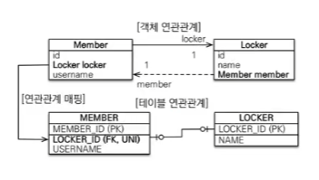   
  양방향의 경우 java 내에서는 양쪽이 그 반대쪽의 참조 변수를 갖고 있다.   
  다만 SQL 은 member 한쪽에서만 foreign key 를 들고 있는 것을 볼 수 있다.   
  
  그럼으로 fk 가 들어있는 Member class 에서는   
  ```java
  @OneToOne
  @JoinColumn(name = "LOCKER_ID")
  private Locker locker;
  ```
  참조만 되는 Locker class 에서는   
  ```java
  @OneToOne(mappedBy = "locker")
  private Member member;
  ```
  같이 작성하면 된다.   
  
  여기에서의 중점은    
  `@JoinColumn` 이 지정된 쪽이 외부키 column 을 만드는 쪽이고   
  `mappedBy` 를 사용하는 곳이 위의 외부키로 mapping 당하는 쪽이다.   
  </details>
  <br/>
  
  <details>
  <summary>
  OrphanRemoval = true 로 연관관계 내의 자식을 자동 삭제하자
  </summary>
  <br>
  
  CascadeType.REMOVE 는 부모가 삭제되면 자식이 삭제된다는 성질을 뜁니다.   
  하지만 .REMOVE 는 arrayList 같이 지정된 parameter 에서 remove 된 자식은 적용하지 않았습니다.   
  이러한 기능을 OrphanRemoval 이 수행해줍니다.   
  
  ```java
  @OneToMany(orphanRemoval=true)
  List<Child> children = new ArrayList<>();
  ```
  로 parent 에서 지정된다면   
  자식이 1개 있을 때     
  ```java
  Parent parent = em.find(Parent.class, 0);
  parent.getChildren().remove(0);
  em.persist(parent);
  ```
  하면 자식이 자동으로 삭제된다는 의미입니다.

  물론 이는 @OneToMany 의 관계 뿐만 아니라 @OneToOne 관계에도 적용됩니다.   
  List 가 아니라 단일 parameter 도 setter 로 null 을 만들어 삭제할 수 있다는 의미입니다.      

  ```java
  Parent parent = em.find(Parent.class, 1L);
  parent.setChild(null);  
  em.persist(parent);
  ```

      
  자신의 주장이 의심되어 확인해보는 피곤한 성격...   
  
  그리고 CascadeType.REMOVE 의 특징을 그대로 갖고 있습니다.      
  부모 entity 가 삭제되면 자식 entity 도 삭제됩니다.   
  
  어! 그러면 persist 된 객체에 그대로 적용하면 데이터베이스에도 바로 적용되니까 좋잖아?!   
  개꿀! 하면서 남용하시면 큰일납니다.   
  
  우선 관계가 완전히 단일하며 종속적이여야 합니다.   
  즉 child 는 parent 외 다른 곳에 fk 가 있으면 안됩니다.      
  fk 에러가 뜨면서 삭제가 안될 수 있습니다.   
  당연한 예기일지도 모르겠지만 그래도 2번 체크합시다.   

  <br>
  
  OrphanRemoval = true 의 자식은    
  부모에게 완전 종속적인가요?   
  다른 곳의 fk 로 사용되고 있지 않나요?    
  
  </details>
  <br>
* # P
  <details>
  <summary>
  Persistance.xml : 설정용 파일
  </summary>
  <br>
  application.properties 의 구 버전이다.   
  resources/META-INF/persistence.xml 에 들어간다.   
  
  ```
  <?xml version="1.0" encoding="UTF-8"?>
  <persistence version="2.2"
  xmlns="http://xmlns.jcp.org/xml/ns/persistence" xmlns:xsi="http://www.w3.org/2001/XMLSchema-instance"
  xsi:schemaLocation="http://xmlns.jcp.org/xml/ns/persistence http://xmlns.jcp.org/xml/ns/persistence/persistence_2_2.xsd">
  <persistence-unit name="hello">
  <properties>
  <!-- 필수 속성 -->
  <property name="javax.persistence.jdbc.driver" value="org.h2.Driver"/>
  <property name="javax.persistence.jdbc.user" value="sa"/>
  <property name="javax.persistence.jdbc.password" value=""/>
  <property name="javax.persistence.jdbc.url" value="jdbc:h2:tcp://localhost/~/testDB"/>
  <property name="hibernate.dialect" value="org.hibernate.dialect.H2Dialect"/>
  
              <!-- 옵션 -->
              <property name="hibernate.show_sql" value="true"/>
              <property name="hibernate.format_sql" value="true"/>
              <property name="hibernate.use_sql_comments" value="true"/>
              <!--<property name="hibernate.hbm2ddl.auto" value="create" />-->
          </properties>
      </persistence-unit>
  </persistence>
  ``` 
  
  `<persistence-unit name="hello">` 에서 name 을 지정해 주면   
  ```java
  Persistence.createEntityManagerFactory("hello");   
  EntityManager em = emf.createEntityManager();
  ```
  으로 연결된다.   
  
  `<property name="hibernate.dialect" value="org.hibernate.dialect.H2Dialect"/>`의 dialect 는 방언인데 
  다양한 데이터베이스를 사투리로서 이해하고 있다. `H2Dialect` 로 주어진 사투리를 표준말로 변경하겠다는 의미이다.

  필요에 따라 추가적으로 옵션을 넣을 수 있다.
  </details>
  <br>

  <details>
  <summary>
  Proxy : entityManager.getReference 로 받아진 lazy query 타입    
  </summary>
  <br>

  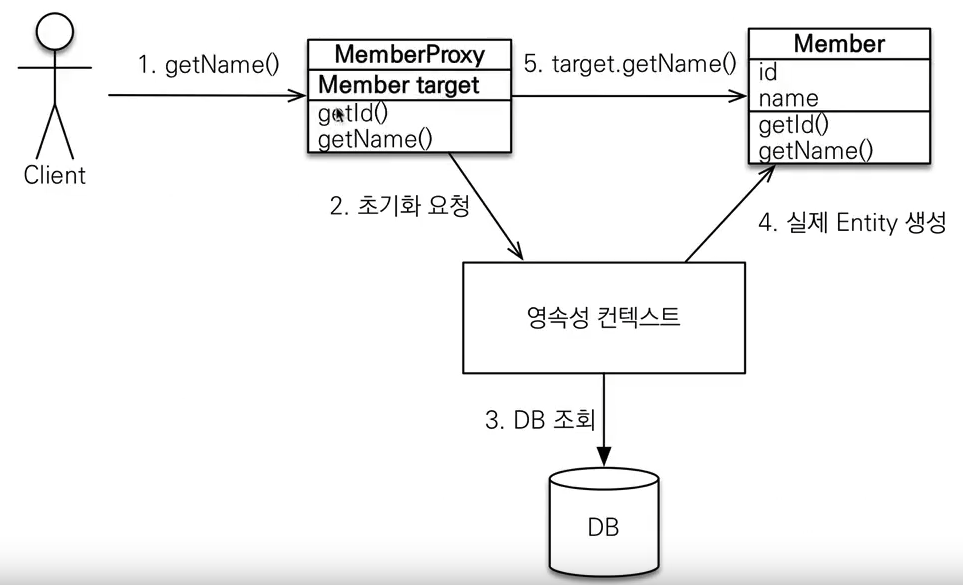   
  
  프록시는 처음 em.getReference 로 받아집니다.   
  받아진 프록시를 .getClass 를 할 경우 $HibernateProxy$ 하고 타입명이 다르게 나온다는 것을 볼 수 있습니다.        
  
  이제 get을 한다면 어떻게 될까요?    
  프록시 안에는 target 이라고 정보를 가져올 객체의 포인터가 있습니다.   
  해당 포인터가 null 을 가리킨다면 db에 쿼리를 날리고 target 을 체우는 형식으로 동작합니다.   
  
  그렇다면...   
  ```java
  Member member = em.getReference(Member.class, 1L);
  member.getName();
  soutv(member.getClass());
  ```
  는 어떻게 출력될까요?   
  프록시로 출력될까요? 아니면 Member 로 출력될까요?   
  
  정답은 프록시입니다.   

  위의 정답이 프록시로 나온다면 저희는 또 한가지 주의할 점이 있습니다.   
  
  바로 타입 체크에서 주의해야 한다는 점입니다.      
  
  `member.getClass() == Member.class` 를 사용할 것이 아니라...   
  `member1 instanceof Member` 를 사용하셔야 일치하게 나옵니다.    
  해당 프록시는 Member 를 상속받기 때문에 instanceof 가 true 로 나옵니다.   
  </details>
  <br>
* # Q
* # R
  <details>
  <summary>
  (Relational methods) 연관관계 편의 메소드를 사용하자
  </summary>
  <br>

  관계가 있는 entity 를 저장할 때 양측의 객체를 변경해야 한다.   
  이를 method 로 묶자.

  ```java
    // many to one 관계 (Child to Parent)
    public void setParent(Parent parent){
        this.parent = parent;
        parent.getChildren().add(this);
    }

    // one to many 관계 (Parent to Child)
    public void addChild(Child child){
        children.add(child);
        child.setParent(this);
    }
  
    // one to one 관계 (Husband to Wife)
    public void setWife(Wife wife){
        this.wife = wife;
        wife.setHusband(this);
    }
    // many to many 는 사용하지 말자
  ``` 

  주의할 점이 있는데   
  연관 관계 메소드가 정의된 곳을 규정해야 한다.   
  Child 에 정의될지 Parent 에 정의될지 일관성이 필요하다.   
  예를 들어 foreign key 가 단일 방향으로 설계되었다면   
  Foreign key 가 규정된 entity 에 정의한다던지 원칙을 정해야 한다.

  또한 양측에 편의 메소드를 정의하여 중복해서 넣는 실수가 생길 수 있다.   
  단일한 방향에 setter를 만들어 사용을 강제하는 것이 좋다.
  </details>
  <br>
  
  <details>
  <summary>
  이제부터 ResponseEntity 로 모든 RestController 를 return 하자
  </summary>
  <br>
  
  ```java
  // 상품 상세 페이지 (단일 상품 정보 가져오기)
  @GetMapping(value = "product/{id}")
  public ResponseEntity<ResponseDTO> getById(@PathVariable long id) {
      return ResponseEntity.ok().body(productService.findOne(id));
  }
  ```
  이 코드에서는 builder method 를 사용했습니다.   
  `ResponseEntity` `.ok` 로 이어지는 것을 보면    
  `ResponseEntity` 빌더에 httpStatusCode 를 지정할 수 있습니다.    
  그래서 이렇게 변경이 가능합니다.    

  `ResponseEntity.ok()` 200   
  `ResponseEntity.badRequest()` 400   
  `ResponseEntity.internalServerError()` 500   
  
  이 외에도 3~4개 정도 더 있지만 다양한 status 들을 모두 포함하고 있지는 않습니다.   

  그래서 builder 안에는 `.status()` 구문이 있는데   
  `ResponseEntity.status(HttpStatus.ACCEPTED)` 같이 사용하면   
  `HttpStatus` 클래스 내의 다양한 status code 들을 사용할 수 있습니다.       
  
  이 외에도 `new ResponseEntity<>(response, HttpStatus.ACCEPTED);` 같은 방법도 있습니다.    
  이는 앞에 선언 후 중간에 response 를 변경해야 할 경우에 사용하면 좋을 것 같습니다.    
  
  `.contentType(MediaType.APPLICATION_JSON)` 같이   
  application type header 를 추가할 수 있고   
  
  `.header(HttpHeaders.CONTENT_LANGUAGE,"ko-KR")` 처럼   
  header 에 자주 쓰이는 구문들을 `HttpHeaders` 에서 가져와 사용할 수 있습니다.   
  
  마지막으로 `.body(response)` 를 붙여 response 를 돌려주면 됩니다.   
  
  
  </details>
  <br>
  
* # S
  <details>
  <summary>
  spring-boot-devtools : html 의 캐싱이나 .class 변경을 감지해서 개발을 편리하게 하는 도구
  </summary>
  <br>

    * 설치방법   
      <br>
      gradle 의 경우   
      `compileOnly ('org.springframework.boot:spring-boot-devtools')`   
      <br>
      maven 경우
      ```
      <dependency>
          <groupId>org.springframework.boot</groupId>
          <artifactId>spring-boot-devtools</artifactId>
          <optional>true</optional>
      </dependency>
      ```

      compileOnly 의 이유   
      [링크](https://docs.spring.io/spring-boot/docs/1.5.16.RELEASE/reference/html/using-boot-devtools.html)      
      <br>
    * 활용   
      파일이 변경된 경우   
      ctrl+shift+F9 (build->recompile)    
      을 눌려 프로젝트에 바로 적용한다.   
      <br>
      .html 의 경우 캐쉬 없이 바로 적용되고   
      .class 의 경우 프로젝트가 rerun 된다.

  </details>
* # T
  <details>
  <summary>
  thymeleaf : ssr과 라우팅을 편리하게 하는 하는 모듈
  </summary>
  <br>

    * 보내고 받는 법
      ```java
      @RequiredArgsConstructor
      @Controller
      public class MemberController {
      @GetMapping("/hello")
      public String hello(Model model){
          model.addAttribute("name","김도형");
          return "hello";
          }
      }
      ```   
      보면 `@RestController` 가 아니라 `@Controller` 를 사용한다는 것을 알 수 있다.    
      rest 는 rest api, 그냥 controller 는 페이지의 전환을 위해서 주로 사용된다.   
      return "hello" 는 resources/templates/hello.html 을 반환한다.   
      `model.addAttribute("name","김도형");`로 변수를 전달하면   
      hello.html 에서   
      `<p th:text="'안녕하세요~' + ${data} + '님'" ></p>`   
      처럼 사용할 수 있다.   
      <br>
    * 문법   
      [여기](https://eblo.tistory.com/55) 를 참조

  </details>
  <br>

  <details>
  <summary>
  데이터베이스 적용을 원치 않는 변수는 @Transient로 만들자
  
  </summary>
  <br>
  
  드랍다운 내용
  </details>
  
* # U
* # V
* # W
* # X
* # Y
* # Z
